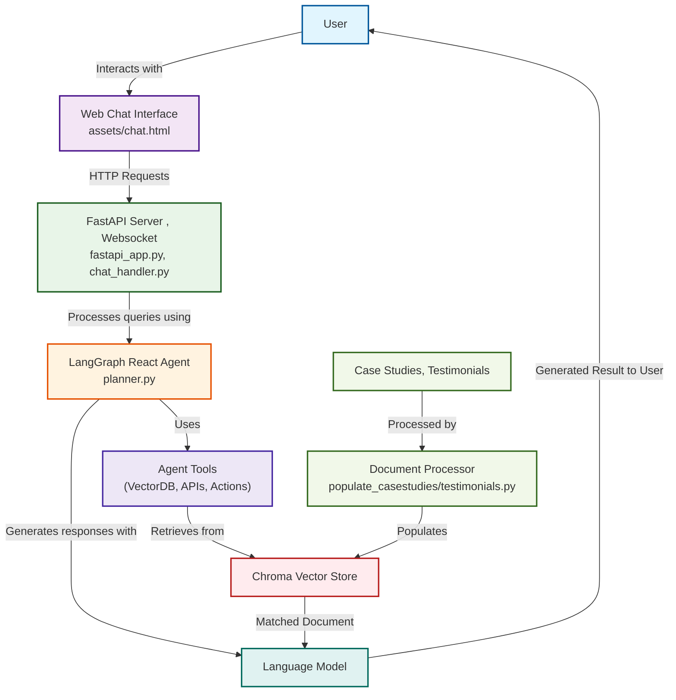

# MultiAgent Boilerplate

## Summary

**MultiAgent Boilerplate** is a production-grade, extensible platform for building AI-powered customer journey agents. It orchestrates conversational flows, tool integrations, and business logic for **Customer Journey** use cases. The system leverages FastAPI, LangChain, ReactAgent, ChromaDB, and Redis for scalable, real-time, and context-aware automation.

---

## Features

- **AI Agent Orchestration:** Modular agents automate onboarding, expert matching, appointment scheduling, and customer engagement.
- **Tool Integration:** Agents interact with tools for onboarding, specialist search, appointment booking, case studies, testimonials, and conversation summarization.
- **Extensible Prompts:** System prompts enforce business rules, consent protocols, and summarization logic.
- **Strict Protocol Enforcement:** Implements mandatory consent, ID management, and summarization protocols for compliance and reliability.
- **Semantic Search:** ChromaDB powers semantic retrieval of case studies and testimonials.
- **State Management:** Redis-backed state and checkpointing for robust session handling.
- **WebSocket Real-Time Communication:** FastAPI WebSocket endpoints for live chat and event streaming.
- **Production-Grade Logging:** Centralized, structured logging for traceability.

---

## Project Structure

```
.
├── agent_tools/           # AI agent tools (customers, specialists, appointments, etc.)
├── conversations/         # Conversation state and thread management
├── websocket/             # WebSocket manager and handlers
├── prompts/               # System and planner prompts
├── data/                  # CSVs and persistent data (appointments, specialists, etc.)
├── chromastore/           # ChromaDB vector stores for semantic search
├── assets/                # Static files for chat UI
├── fastapi_app.py         # FastAPI application entrypoint
├── llm_utils.py           # LLM and embedding utilities
├── utils.py               # Utility functions and environment management
├── config.py              # Company and chatbot configuration
├── populate_casestudies.py # Script to populate ChromaDB with case studies
├── populate_testimonials.py # Script to populate ChromaDB with testimonials
└── README.md              # Project documentation
```

---

## Setup

1. **Install dependencies:**
   ```bash
   pip install -r requirements.txt
   ```

2. **Configure environment:**
   - Create a `.env` file with required keys (OpenAI, Google, Redis, etc.).
   - Modify config in `config.py` for company-specific settings (CompanyName, ChatbotName, etc.).

3. **Populate vector databases:**
    - Add Case Studies and Testimonials to ChromaDB by placing JSON/txt files in the `casestudies/` and `testimonials/` directories respectively and populate by running:
   ```bash
   python populate_casestudies.py
   python populate_testimonials.py
   ```

---

## Running the Application

1. **Start the FastAPI server:**
   ```bash
   python fastapi_app.py
   ```

2. **Access the chat interface:**
   - Open your browser to `http://localhost:8000`

---

## Architecture



- **FastAPI**: Serves REST and WebSocket endpoints for chat and event streaming.
- **LangGraph ReactAgent**: Orchestrates agent logic, tool calls, and prompt management.
- **ChromaDB**: Provides semantic search for case studies and testimonials.
- **Redis**: Manages state, session history, and checkpointing.
- **WebSocketManager**: Handles real-time client connections and message broadcasting.
- **Planner Prompts**: Enforce business rules, consent, ID management, and summarization protocols.

---

## Future Customization

- **Add new tools:** Implement in `agent_tools/` and register with the planner `agent_tools/planner.py`.
- **Update prompts and business logic:** Edit `prompts/planner_prompts.py`.
- **Integrate new data sources:** Update population scripts and vector database logic.
- **Extend agent capabilities:** Add new flows, protocols, or integrations as needed by adding new tools.

---

## Contributing

Contributions are welcome! Please open issues or submit pull requests for bug fixes, enhancements, or new features. For major changes, discuss proposals in advance.

---

## License


This project is intended for production use and can be adapted for commercial deployments. Please review and comply with all third-party licenses